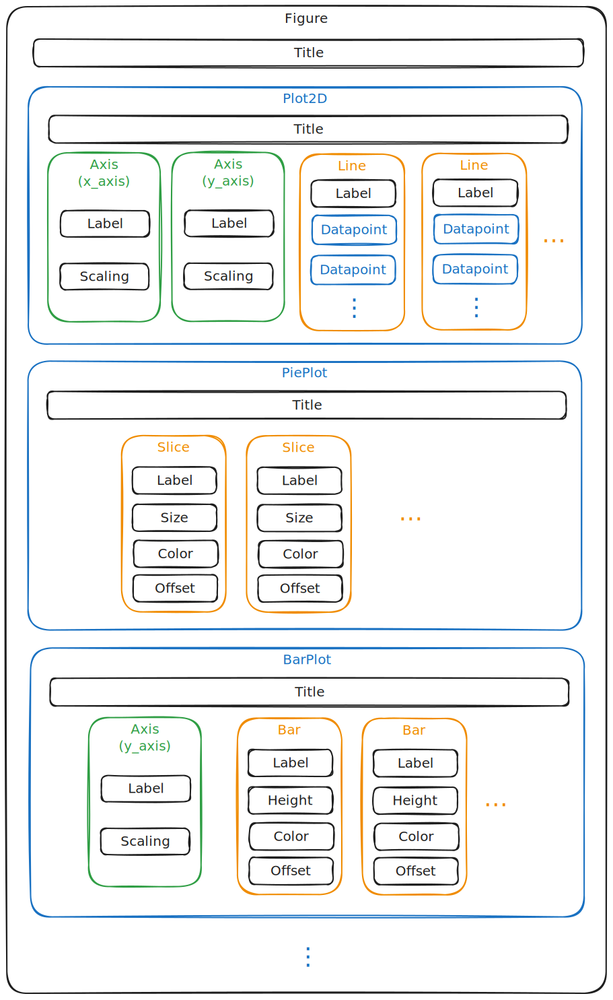

Overview
========

How PlotSerializer sees diagrams
---------------------------------

PlotSerializer uses its own data model for representing scientific diagrams.
The base class for this data model is ``plot_serializer.model.Figure``.
A full Json-Schema for this model is available in this documentation as well.

The basics are illustrated by the following diagram:

